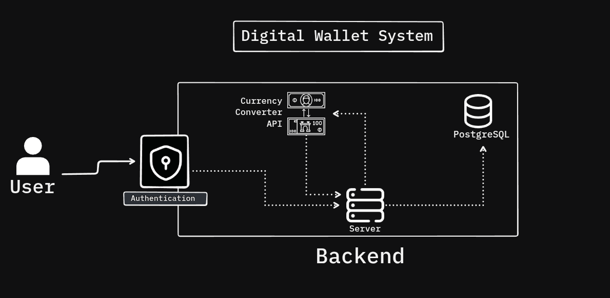

# Digital Wallet System

A comprehensive backend implementation for digital wallet operations built with Spring Boot. This application provides secure user authentication, account management, peer-to-peer payments, and a marketplace for digital products.

## Features

- **User Management** - Registration and authentication with secure password encryption
- **Wallet Operations** - Fund accounts and check balances with multi-currency support
- **Payment System** - Peer-to-peer money transfers with real-time balance updates
- **Product Marketplace** - Buy and sell digital products using wallet balance
- **Transaction History** - Complete audit trail with detailed transaction records
- **Security** - Spring Security integration with input validation

## Technology Stack

- **Framework**: Spring Boot 3.5.3
- **Language**: Java 21
- **Database**: PostgreSQL (Neon)
- **Security**: Spring Security with BCrypt
- **Build Tool**: Maven
- **Architecture**: RESTful API

## Live Application

The application is deployed and accessible at:
```
https://digital-wallet-backend-service.onrender.com/api/v1
```

*Deployed on Render cloud service for easy access and testing.*

## Documentation

For complete API documentation with all endpoints, request/response formats, and examples, visit:
[API Documentation](docs/README.md)

## Quick Test

Test the API with these sample requests:

```bash
# Register a user
curl -X POST https://digital-wallet-backend-service.onrender.com/api/v1/register \
  -H "Content-Type: application/json" \
  -d '{"username":"demo","password":"demo123"}'

# Fund account (use Basic Auth: demo:demo123)
curl -X POST https://digital-wallet-backend-service.onrender.com/api/v1/fund \
  -H "Content-Type: application/json" \
  -H "Authorization: Basic ZGVtbzpkZW1vMTIz" \
  -d '{"amt":100.00}'

# Check balance
curl -X GET https://digital-wallet-backend-service.onrender.com/api/v1/bal \
  -H "Authorization: Basic ZGVtbzpkZW1vMTIz"
```

## API Endpoints

| Endpoint | Method | Description | Authentication |
|----------|--------|-------------|----------------|
| `/api/v1/register` | POST | Register new user | No |
| `/api/v1/fund` | POST | Add funds to account | Yes |
| `/api/v1/pay` | POST | Pay another user | Yes |
| `/api/v1/bal` | GET | Check account balance | Yes |
| `/api/v1/stmt` | GET | View transaction history | Yes |
| `/api/v1/product` | POST | Add new product | Yes |
| `/api/v1/product` | GET | List all products | No |
| `/api/v1/buy` | POST | Purchase a product | Yes |

## Prerequisites

- Java 21 or higher
- Maven 3.6 or higher

## Local Development

1. **Clone the repository**
   ```bash
   git clone <repository-url>
   cd Digitalwallet
   ```

2. **Build the project**
   ```bash
   ./mvnw clean install
   ```

3. **Run the application**
   ```bash
   ./mvnw spring-boot:run
   ```

4. **Access the application**
   - API Base URL: `http://localhost:8080/api/v1`

## Project Structure

```
src/
├── main/java/com/assignment/Digitalwallet/
│   ├── Config/              # Security and application configuration
│   ├── Controller/          # REST API controllers
│   ├── Dto/                 # Data Transfer Objects
│   ├── Exception/           # Custom exception handlers
│   ├── Model/               # JPA entities
│   ├── Repository/          # Data access layer
│   └── Service/             # Business logic layer
└── resources/
    └── application.properties
```

## Authentication

The application uses Spring Security with HTTP Basic Authentication. After registering, use your username and password for authenticated endpoints.

**Base64 Encoding Example:**
```bash
echo -n "username:password" | base64
```

## Docker Support

Build and run with Docker:
```bash
docker build -t digital-wallet .
docker run -p 8080:8080 digital-wallet
```

## Architecture
The Digital Wallet System follows a layered architecture pattern with secure authentication, external API integration for currency conversion, and persistent data storage.



The architecture includes:
- **User Authentication** - Secure login and session management
- **API Server** - RESTful endpoints for all wallet operations
- **Currency Converter API** - External service for real-time currency conversion
- **PostgreSQL Database** - Persistent storage for users, transactions, and products
- **Backend Services** - Business logic for payments, products, and transactions

## License
This project is developed as part of an assignment.